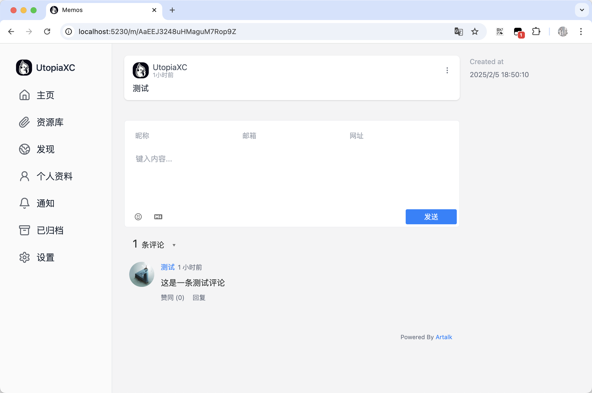
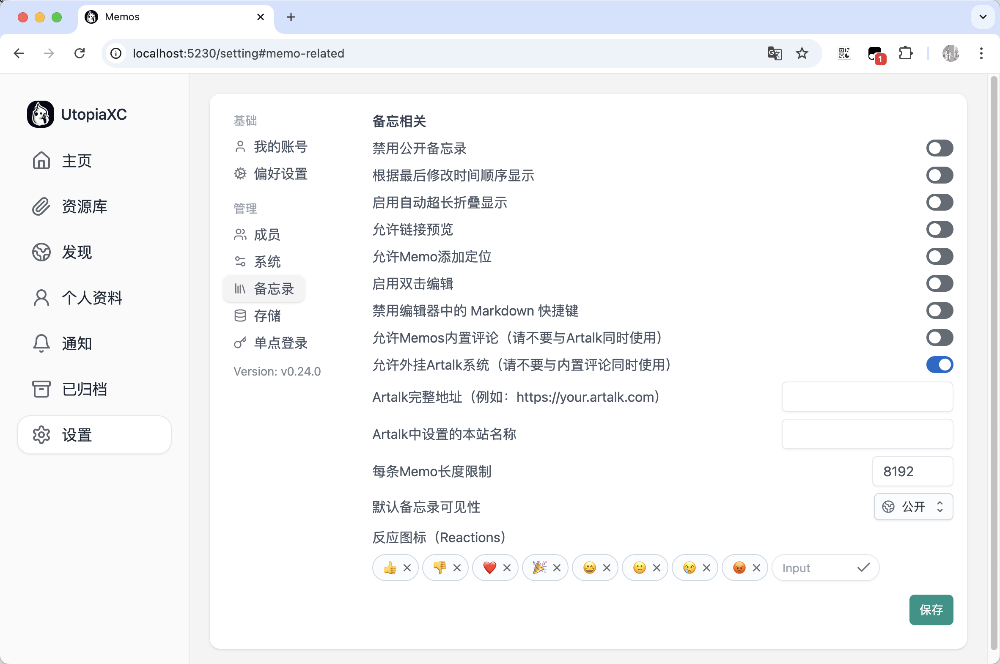

# Memos with Artalk

This is a custom memos with artalk switch that user can easily attach artalk on their memos.  

这是一个基于[Memos]()的简单修改版，仅预埋了Artalk的DIV，并提供了几个选项供用户可以快速地在Memos配置Artalk评论系统。另外，对设置中部分没有汉化的内容进行了简单汉化。  

本项目起因：由于0.20以上Memos页面加载逻辑改变，原有通过添加JS代码来添加Artalk的方法已经失效。方便起见，我直接修改了对应部分的源代码来插入Artalk系统。  

# Installation
安装方法与原版一致，请参考原版文档。  
仅需将docker镜像改为以下镜像即可：
```bash
#Linux/amd64
docker pull utopiaxc1025/memos-with-artalk:amd64-1.0

#ARM
docker pull utopiaxc1025/memos-with-artalk:arm-1.0
```

# Version Updagrade
理论上可以从官方镜像直接切换到本镜像而不会有什么影响，但是强烈不建议你这样做。  
  
不保证本分支版本是否会同步原仓库主分支最新代码，使用本镜像前需谨慎。  
  
如果使用中存在任何BUG或问题，请在Issues中反馈，或协助提交代码，感谢。  

# Demo

